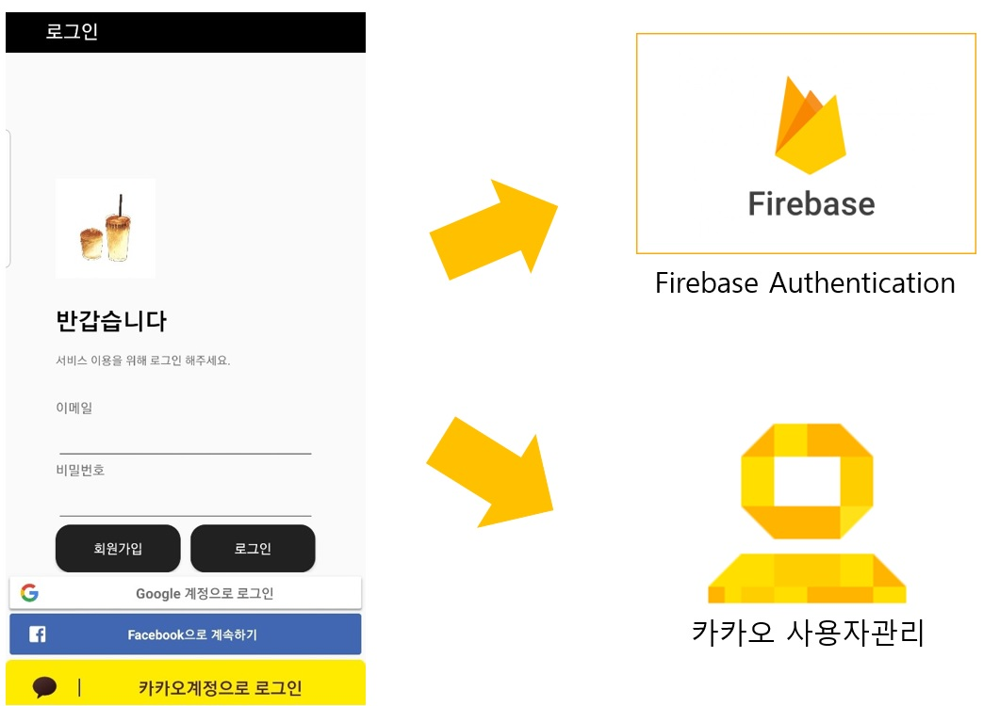
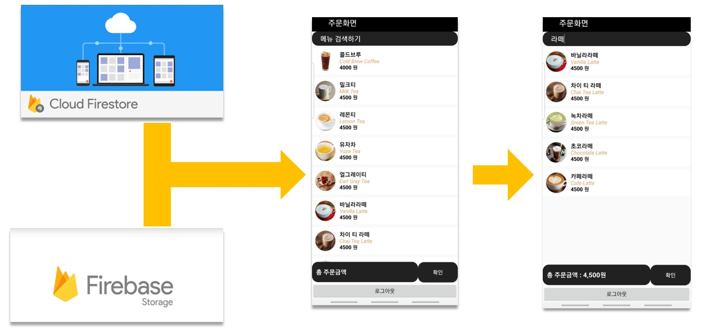
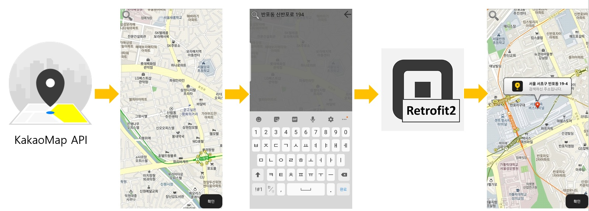
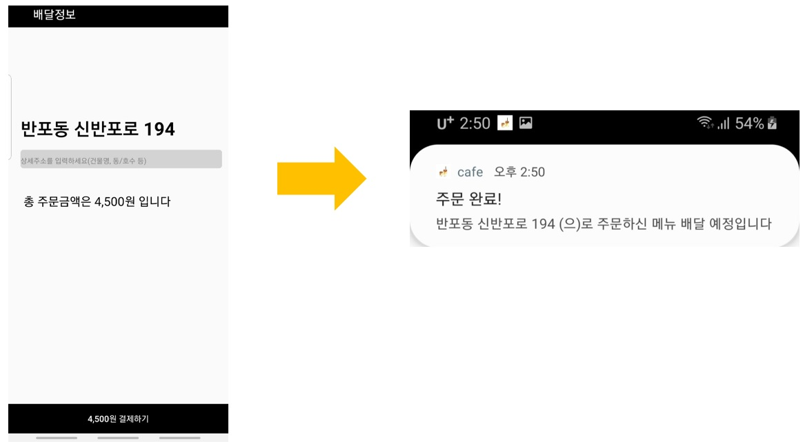

Coffee Delivery Service 
==========================

#
Introduction 
=============
주문받은 메뉴를 지정한 주소로 배달하겠다는 알림을 보내는 APP입니다.

주요 외부사이트 계정의 로그인 연동 기능과 앱 내에서의 회원가입,로그인을 할 수 있는 Login Activity에서 로그인 후, 메인 액티비티에서 사용자가 원하는 메뉴들을 검색하거나 스크롤하여 찾은 뒤, 클릭하여 주문을 합니다. 그리고 맵 액티비티로 넘어가 배달받을 주소를 입력하고 Result Activity로 넘어갑니다. 사용자는 Result Activity에서 주문한 메뉴의 가격과 검색한 주소를 확인하고 결제 버튼을 누르면 알람을 받습니다.

#
Detail Introduction
===================
##
Login Activity

Firebase에서 제공하는 Authentication을 이용하여 회원가입과 로그인을 합니다. 액티비티 하단의 구글 계정으로 로그인,페이스북 계정으로 로그인하기 기능 또한 Firebase Authentication에서 관리됩니다.
카카오 계정으로 로그인하기의 경우에는 Kakao Developers에서 앱을 생성하여 사이트에서 제공하는 API를 이용하여 구성 및 구현을 하였습니다.

##
Main Activity

메인 액티비티에서는 Cloud Firestore에 저장되어있는 데이터들과 Firebase Storage에 업로드된 이미지들을 가져와 리사이클러뷰의 뷰홀더에 넣어 레이아웃에 표현합니다. 이미지를 가져올 때, Glide 라이브러리를 사용하였습니다. 그리고 사용자의 편의를 위해 메뉴 위쪽에 검색기능을 만들어 사용자가 원하는 것을 쉽게 찾을 수 있게 하였습니다. 

##
Map Activity

이 액티비티에서는 먼저 Kakao 지도 Android API를 사용하여 맵을 구현하고, Search Icon 클릭 시, 주소를 검색 할 수 있습니다. 주소를 검색하면 Retrofit2 라이브러리를 사용하여 검색한 주소의 값들(주소,위도,경도)을 가져오게 됩니다. 얻은 위도와 경도를 바탕으로 지도에 마커를 표시하고 마커의 말풍선에 위도,경도와 마찬가지로 얻어왔던 주소를 표시해줍니다. 

##
Result Activity

Result Activity에서는 MainActivity에서 내가 선택했던 메뉴들의 총 가격과 Map Activity에서 검색했던 주소를 확인할 수 있습니다. 그리고 상세주소를 입력하고 하단의 버튼을 누르면 주소와 상세주소를 합쳐서 사용자에게 알람을 보냅니다.

#
Reference
=========

[Firbase](https://firebase.google.com/)

[Firebase Docs](https://firebase.google.com/docs)

[Kakao Developers](https://developers.kakao.com/)

[KakaoMap API](http://apis.map.kakao.com/android/guide/)
